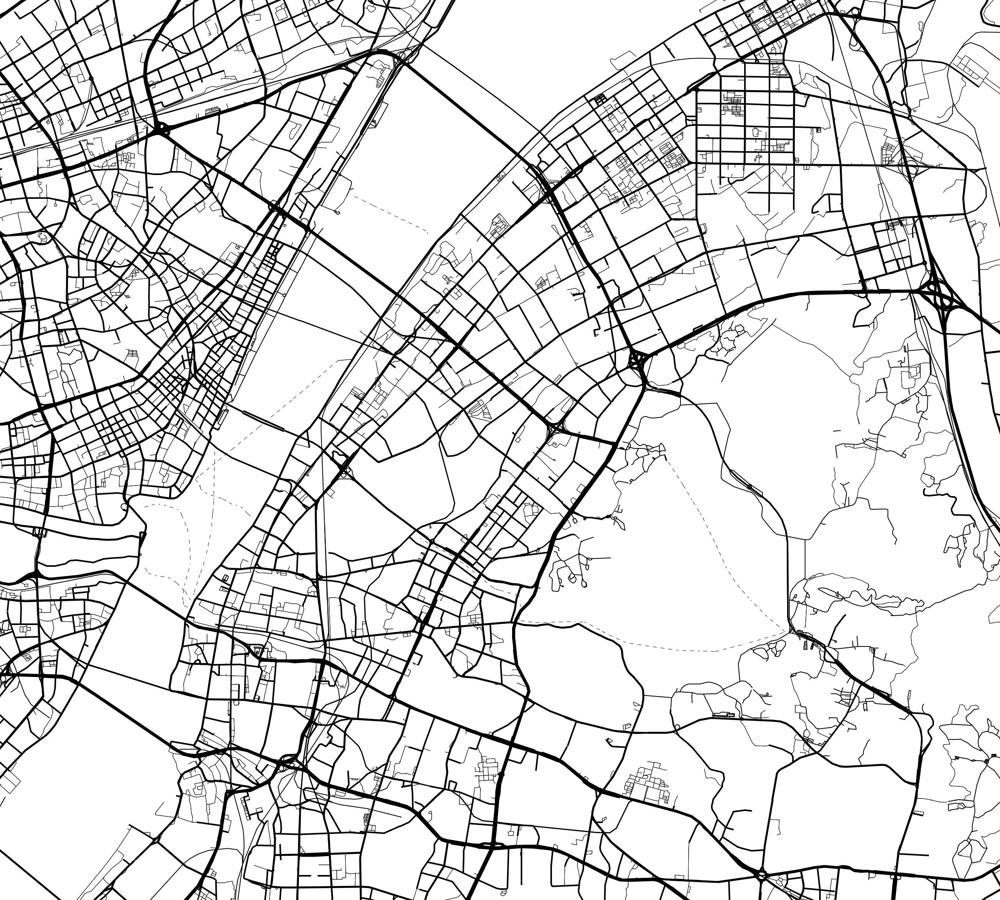
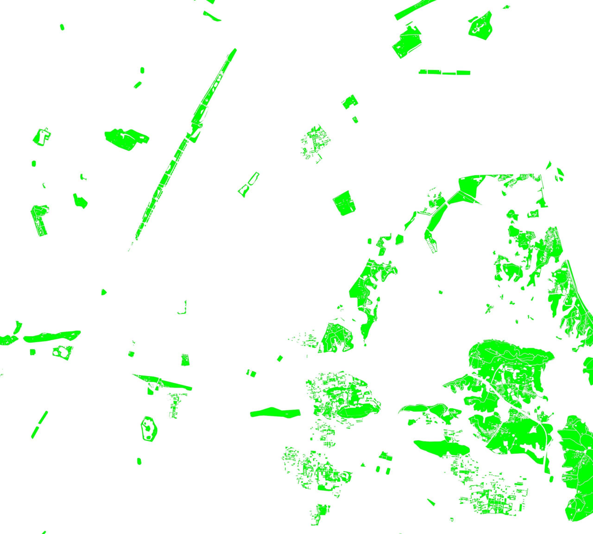
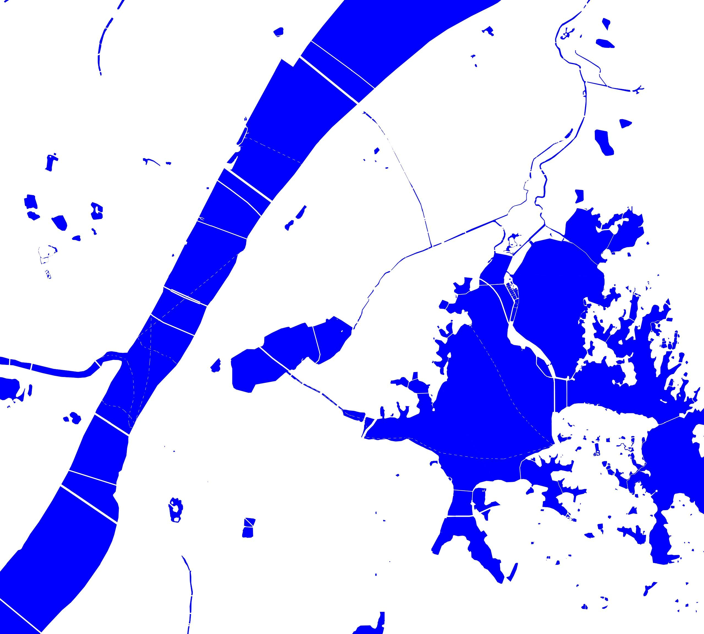
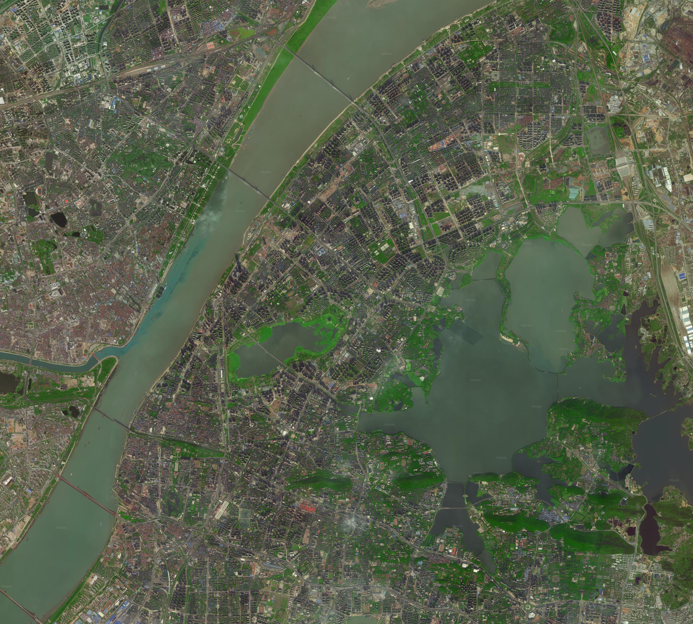

# Baidu-Styled-Tile-Downloader
A Tool for downloading Baidu raster tile according to specific bmap style based on Chinese administrative regions.

一款基于中国行政区划，根据特定百度地图样式生成栅格瓦片合成图的工具。

<!-- MarkdownTOC autolink='true' autoanchor='true' -->

- [依赖](#%E4%BE%9D%E8%B5%96)
- [用法](#%E7%94%A8%E6%B3%95)
- [效果](#%E6%95%88%E6%9E%9C)
- [style example](#style-example)
- [开源协议](#%E5%BC%80%E6%BA%90%E5%8D%8F%E8%AE%AE)

<!-- /MarkdownTOC -->


<a id="%E4%BE%9D%E8%B5%96"></a>
## 依赖

- 图片合成：pillow
- 瓦片请求：requests

<a id="%E7%94%A8%E6%B3%95"></a>
## 用法

> 步骤一：配置config.py文件

|字段名|含义|参考|
|:--|:--|:--|
|TARGET_TYPE|栅格类型|0表示个性地图；1表示遥感影像|
|MY_STYLE|地图样式|说明见[style example](#style-example)|
|TARGET_AD|目标行政区划名称|合规行政区划名称见[./ChinaAD.py](./ChinaAD.py)|
|TARGET_LEVEL|目标地图级别|不同要素可视级别不同，详见[style example](#style-example)|
|TARGET_OBJECT|目标突出要素|用于命名输出文件夹，指瓦片style中突出的要素，无则填''|
|ROOT_DIR|输出根目录|无|

> 步骤二：运行__init__.py文件

```shell
python __init__.py
```

<a id="%E6%95%88%E6%9E%9C"></a>
## 效果

以武汉市武昌区为例

<div style="display: flex;flex-direction: row;flex-wrap: wrap;">
	<div style="display: flex;flex-direction: column;align-items: center;margin-right:30px;">
		
		<strong style='font-size: 20px'>building</strong>
	</div>
	<div style="display: flex;flex-direction: column;align-items: center;margin-right:30px;">
		
		<strong style='font-size: 20px'>road</strong>
	</div>
	<div style="display: flex;flex-direction: column;align-items: center;margin-right:30px;">
		
		<strong style='font-size: 20px'>green</strong>
	</div>
	<div style="display: flex;flex-direction: column;align-items: center;margin-right:30px;">
		
		<strong style='font-size: 20px'>water</strong>
	</div>
	<div style="display: flex;flex-direction: column;align-items: center;margin-right:30px;">
		
		<strong style='font-size: 20px'>RS Image</strong>
	</div>
</div>

<a id="style-example"></a>
## style example

样式json可以在[百度地图个性在线编辑器](http://wiki.lbsyun.baidu.com/custom/)中进行测试，样式满意再使用

style是一个json数组，由三部分组成：featureType(要素)，elementType(属性)和stylers(样式)，格式如下：

```javascript
style = [{
	"featureType": '',
	"elementType": '',
	"stylers": {
		//...
	}
}]
```

> featureType

格式： `解释 - 名称 - 显示范围`

- 全部 - all - [4,18]
	- 地图背景 - background - [4,18]
		- 陆地 - land - [4,18]
		- 水系 - water - [4,18]
		- 绿地 - green - [10,18]
		- 人造区域 - manmade - [14,18]
			- 地铁设施 - subwaystation - [17,18]
			- 教育区域 - education - [14,18]
			- 医疗区域 - medical - [15,18]
			- 景点区域 - scenicspots - [14,18]
		- 建筑物 - building - [15,18]
	- 道路 - road - [6,18]
		- 高速及国道 - highway - [6,18]
		- 城市主路 - arterial - [10,18]
		- 普通道路 - local - [14,18]
		- 铁路 - railway - [8,18]
		- 地铁 - subway - [12,18]
	- 兴趣点 - poilabel - [12,18]
		- 机场 - airportlabel
		- 旅游景点 - scenicspotslabel
		- 教育 - educationlabel
		- 医疗 - medicallabel
	- 行政区划 - administrative - [4,18]
		- 行政标注 - districtlabel - [4,18]
			- 大洲 - continent - (18,)
			- 国家 - country - 3
			- 城市 - city - [5,13]
			- 区县 - district - [5,13]
			- 乡镇 - town - [11,15]
		- 边界线 - boundary - [3,10]

> elementType

- 全部 - all
	- 几何 - geometry 
		- 填充 - geometry.fill
			- 顶层填充 - geometry.topfill
			- 边缘填充 - geometry.sidefill
		- 线粗 - geometry.stroke
	- 标注 - labels
		- 文本 - labels.text
			- 文本填充 - labels.text.fill
			- 文本线粗 - labels.text.stroke
		- 图标 - labels.icon

> stylers

- 是否可见 - visibility - on/off
- 颜色 - color - 十六进制颜色+透明度（#000000ff）
- 色相 - hue - 十六进制颜色（#000000）
- 亮度 - lightness - [-100,100]，默认为1
- 饱和度 - saturation - [-100,100]，默认为1
- 宽度 - weight - [0,8]，默认为1，只对点和线要素有效
- 字号 - fontsize - 如28
- 指定级别 - level - [4,18]，仅对指定级别使用该样式
- ~~（未知）curZoomRegionId~~
- ~~（未知）curZoomRegion~~

<a id="%E5%BC%80%E6%BA%90%E5%8D%8F%E8%AE%AE"></a>
## 开源协议

本项目遵循GNU GENERAL PUBLIC LICENSE Version 3协议。